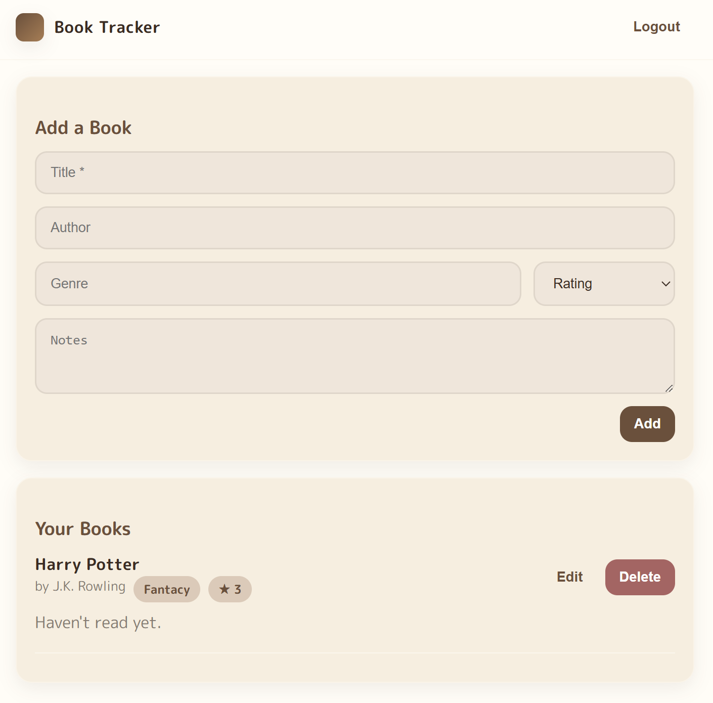

# Book Tracker App
A simple application to manage books (add, edit, delete)

## Features
- User registration & login (JWT auth)
- Add / edit / delete books
- Redux Toolkit state management
- MongoDB Atlas + Express backend
- Vite + React frontend

## How to Run the Project
cd backend
npm install
npm run dev

cd frontend
npm install
npm run dev

## Screenshot

